# Entorno de desarrollo — Semana 1

## Integrante 1: Albornoz Azurza Gonzalo Alessandro

### Paso 1 — JDK
- Comando: `java -version`
- Versión: `21.0.12.1`
- Captura:

  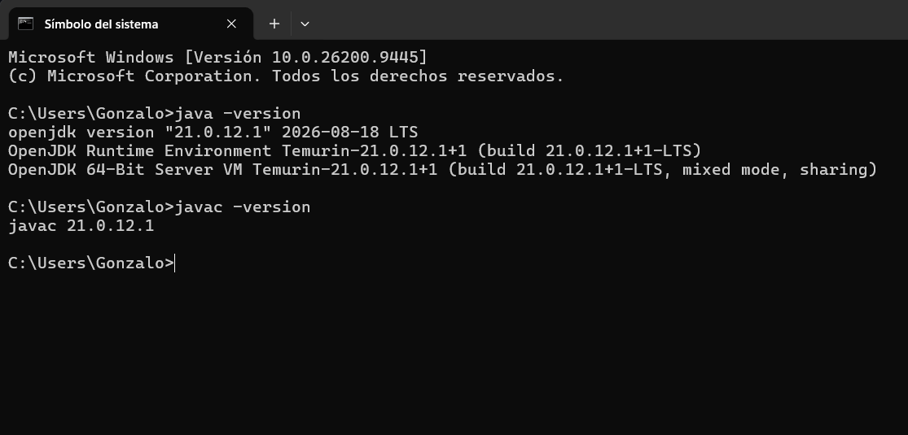

### Paso 3 — Maven
- Comando: `mvn -version`
- Versión: `3.9.16`
- Captura:

  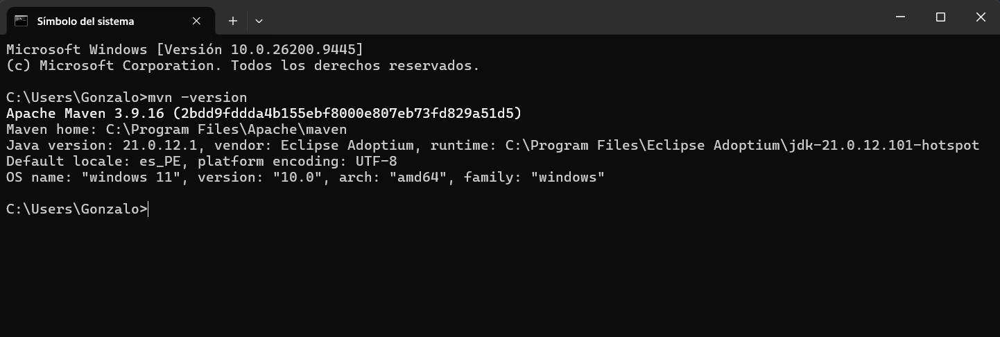

### Paso 5 — Build
- Comando: `./mvnw package` (o `mvn package`)
- Resultado: `BUILD SUCCESS`
- Captura:

  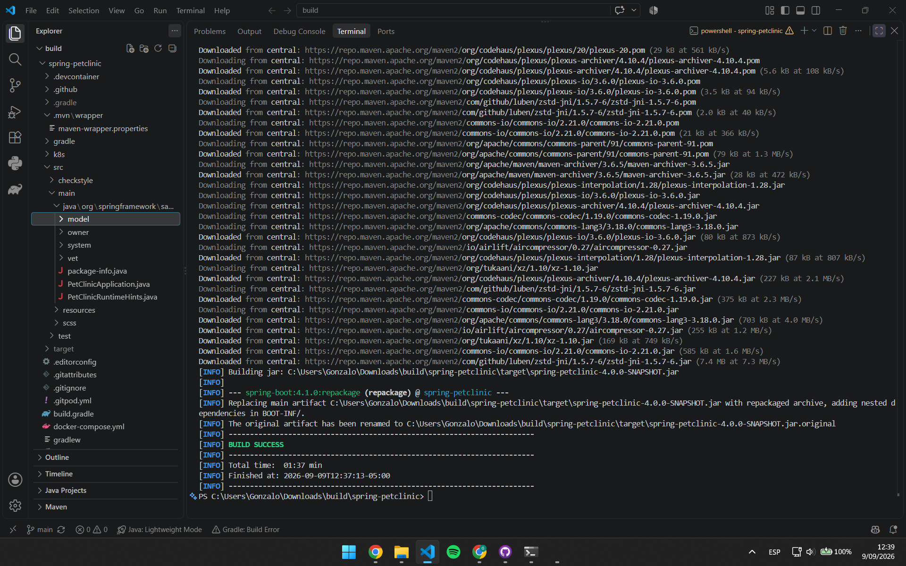

### Git
- Comando: `git --version`
- Versión: `2.55.0`

---

## Integrante 2: Suazo Zanabria Dino Paul Roel

### Paso 1 — JDK
- Comando: `java -version`
- Versión: `21.0.11`
- Captura:

  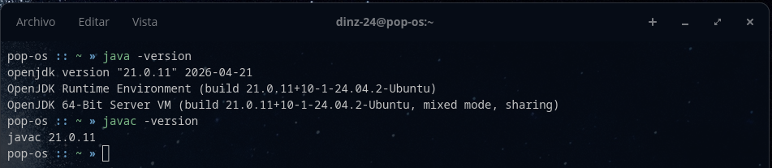

### Paso 3 — Maven
- Comando: `mvn -version`
- Versión: `3.8.7`
- Captura:

  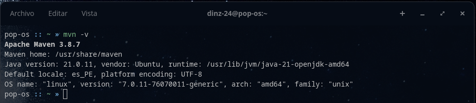

### Paso 5 — Build
- Comando: `./mvnw package` (o `mvn package`)
- Resultado: `BUILD SUCCESS`
- Captura:

  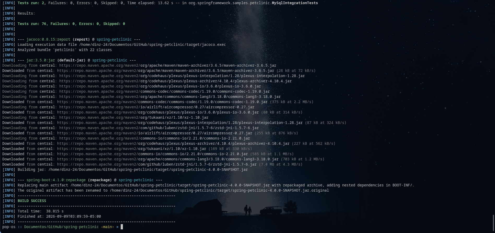

### Git
- Comando: `git --version`
- Versión: `2.55.0`

---

## Integrante 3: Vargas Ponce Luis Angel

### Paso 1 — JDK
- Comando: `java -version`
- Versión: `21.0.12.1`
- Captura:

  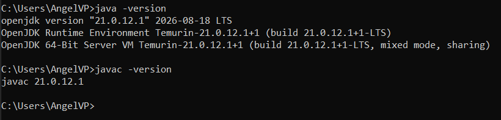

### Paso 3 — Maven
- Comando: `mvn -version`
- Versión: `3.9.16`
- Captura:

  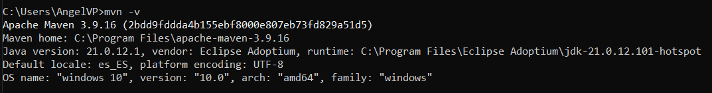

### Paso 5 — Build
- Comando: `./mvnw package` (o `mvn package`)
- Resultado: `BUILD SUCCESS`
- Captura:

  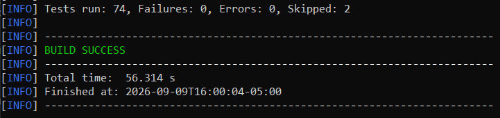

### Git
- Comando: `git --version`
- Versión: `2.55.0`

---

## Integrante 4: Zamudio Sanchez Farid Paolo

### Paso 1 — JDK
- Comando: `java -version`
- Versión: `21.0.12.1`
- Captura:

  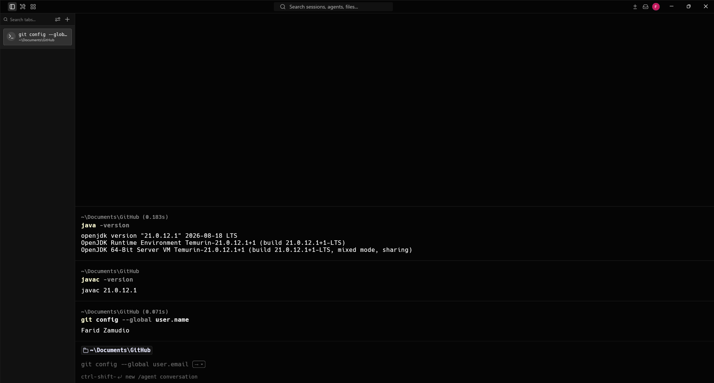

### Paso 3 — Maven
- Comando: `mvn -version`
- Versión: `3.9.16`
- Captura:

  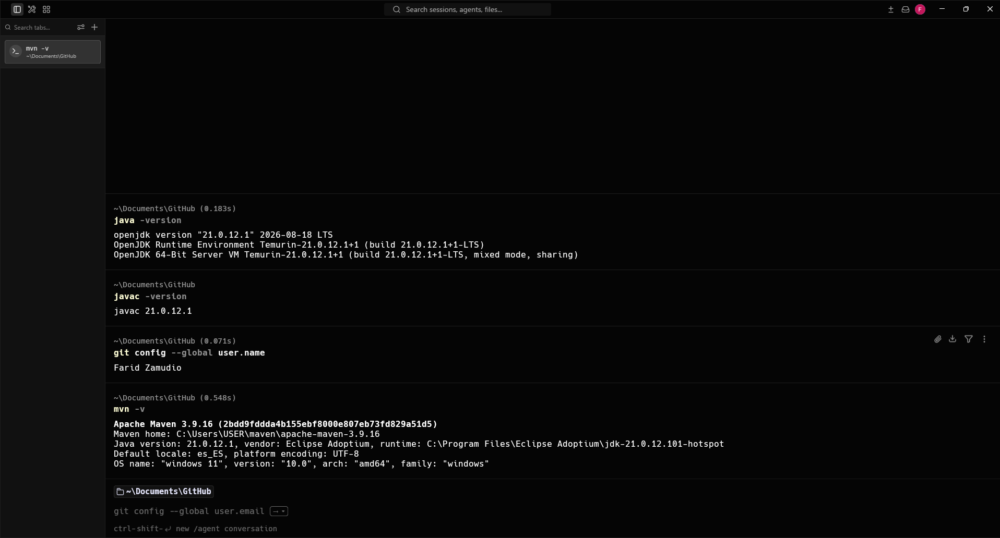

### Paso 5 — Build
- Comando: `./mvnw package` (o `mvn package`)
- Resultado: `BUILD SUCCESS`
- Captura:

  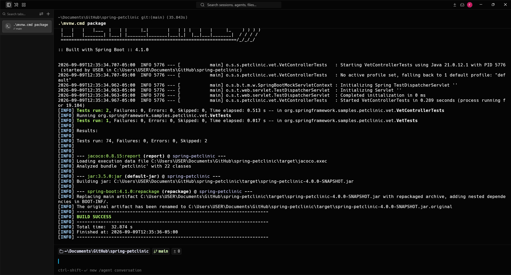

### Git
- Comando: `git --version`
- Versión: `2.55.0`

---

## Integrante 5: Chavez Oliva Carlos Daniel

### Paso 1 — JDK
- Comando: `java -version`
- Versión: `21.0.12.1`
- Captura:

  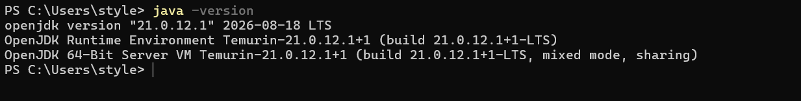

### Paso 3 — Maven
- Comando: `mvn -version`
- Versión: `3.9.16`
- Captura:

  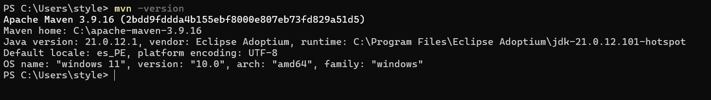

### Paso 5 — Build
- Comando: `./mvnw package` (o `mvn package`)
- Resultado: `BUILD SUCCESS`
- Captura:

  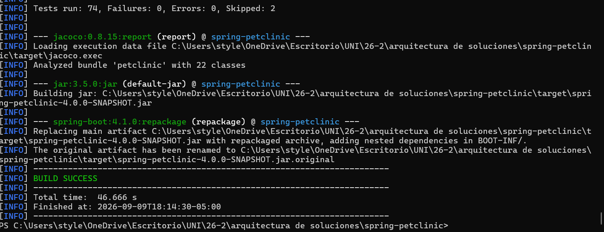

### Git
- Comando: `git --version`
- Versión: `2.54.0`